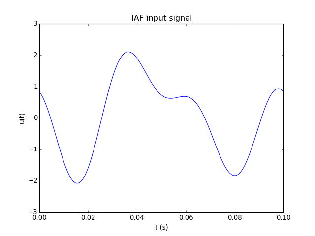
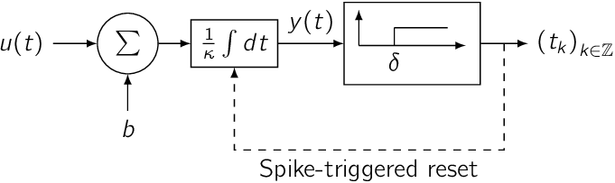
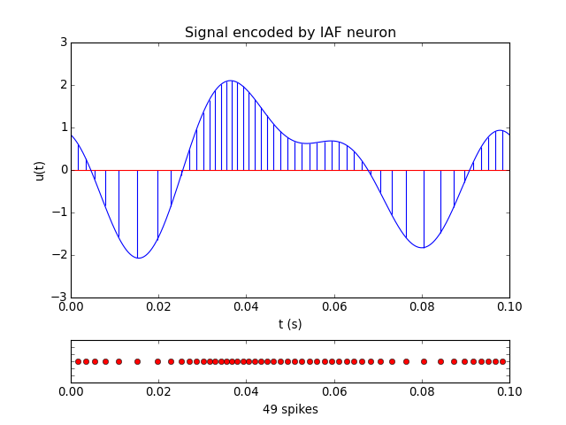
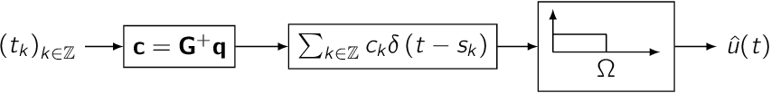
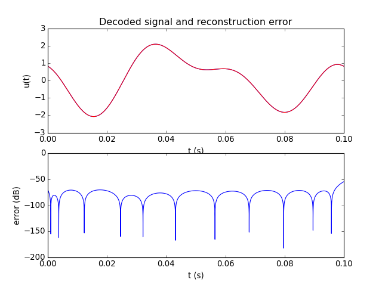
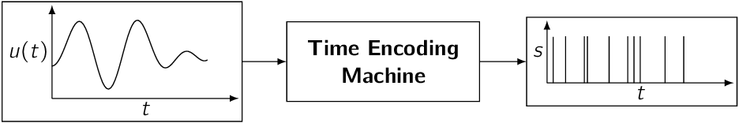
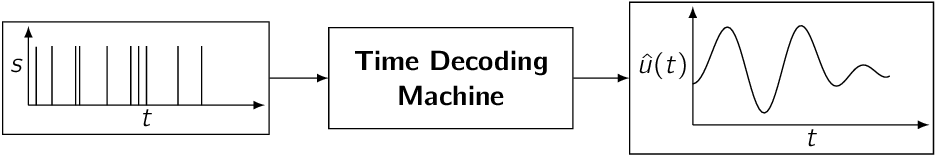

.. -*- rst -*- 

Overview of Time Encoding and Decoding
======================================

What is Time Encoding?
----------------------

Consider a simple analog signal:

If this signal is bandlimited, then it can be faithfully represented
- or *encoded* - by a sequence of uniformly spaced samples - that is,
the original analog signal can be *perfectly reconstructed* from the
samples. This follows from Shannon's Sampling Theorem. There are both
natural and man-made systems, however, that encode analog input
information as samples or events that are *non-uniformly* spaced in
time. An Integrate-and-Fire neuron, for example, can *time encode* a
stimulus signal by transforming it into a sequence of time events or
*spikes*: |lazar_time_2004|_:

To illustrate the encoding process, the sample signal depicted above
(with a bandwidth of 32 Hz and a duration of 100 ms) is
encoded below using the Integrate-and-Fire neuron as a series of
non-uniformly spaced spikes (represented by the red markers in
the plot below):

The existence of such systems motivates the question as to whether
signals that are encoded in such a manner can be faithfully recovered.

What is Time Decoding?
----------------------

Under appropriate conditions |lazar_time_2004|_, a signal that has
been time encoded as a sequence of spikes can be faithfully recovered
using a *time decoding machine*. The circuit below uses sinc kernels
to reconstruct the encoded signal:

Processing a time encoded signal with the above circuit results in the
following reconstruction. Although the actual input signal is
discretely represented with traditional computational models, the
reconstruction can be made arbitrarily precise for bandlimited
stimuli.

What are Time Encoding Machines?
--------------------------------

A *Time Encoding Machine*, or *TEM* |lazar_perfect_2004|_, represents
analog information in the time domain. TEMs arise in single-input
sigle-output (integrate-and-fire neurons, asynchronous sigma-delta
modulators), single-input multi-output (population encoding models),
and other classical circuit configurations:

What are Time Decoding Machines?
--------------------------------

A *Time Decoding Machine*, or *TDM* |lazar_perfect_2004|_, recovers a
signal encoded by a Time Encoding Machine according to a fidelity
criterion:

Why Should Neuroscientists Care About Time Encoding?
----------------------------------------------------

- Time Encoding Machines are *in silico* models of neural encoding.
  Under appropriate conditions, these encoders faithfully represent
  information about stimuli |lazar_perfect_2004|_.
- The theory underlying time encoding applies to well-understood
  neuron models such as the (leaky) Integrate-and-Fire neuron
  |lazar_multichannel_2005|_, the Hodgkin-Huxley neuron, and feedback
  and feedforward configurations of these models |lazar_time_2006|_.
- The theory of time encoding has been extended to address the
  representation of scalar-valued stimuli by populations of neurons
  |lazar_information_2007|_ |lazar_faithful_2008|_. In particular,
  the time encoding and decoding of video signals has been
  successfully performed using ensembles of neurons  
  |lazar_video_2008|_ |lazar_encoding_2010|_.

Why Should Engineers/Computer Scientists Care About Time Encoding?
------------------------------------------------------------------

- Signal representations in the time domain can exploit the increasing
  time resolution that scaling of integrated circuits technology
  |lazar_perfect_2004|_ (Moore's law) continues to offer. Traditional
  A/D conversion, by contrast, is adversely affected by the power
  density requirements that call for lower and lower voltages.
- Time encoding theory extends the application domain of
  well-understood concepts in information theory, communications
  theory, signal processing and machine learning to asynchronous
  information representation and computation |lazar_time_2006|_.
- Time encoding theory has been extended to address the
  faithful representation of real-time (arbitrarily long) signals
  |lazar_overcomplete_2008|_ and non-bandlimited signals
  |lazar_reconstruction_2009|_.

Further Reading
---------------

More literature on time encoding and decoding is available on the
`Bionet publication server <http://bionet.ee.columbia.edu/publications/>`_.

.. include:: bibliography.rst

